# funshare®

funshare® is an app to virtually connect boardgame lovers and allow them to meet and play in the real world! 🎲🃏

## 🍀 Getting started

- Install mongoDB
- In app.js there is connection set up using mongoose and funshare collection is created

## 🍀 Dependencies

1. Run `yarn install` in project directory to install Express.`yarn start` to run servers on port 5001
2. `cd client` and `yarn install` to install React. `yarn start` to run servers on port 3000.

## 🍀 API

Create a `.env` file

- visit https://opencagedata.com/, register and create your own API key
- create a variable REACT*APP_OCD_API_KEY=*\*\* and replace the \_ with your own key

## 🍀 User Flow Diagram

## 🍀 User Flow in Pictures

Sign In form

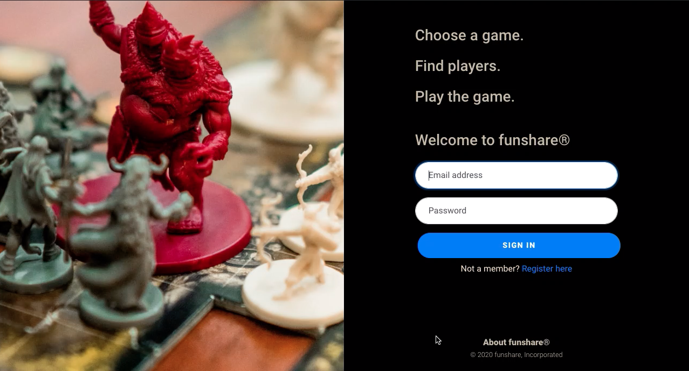

About funshare®

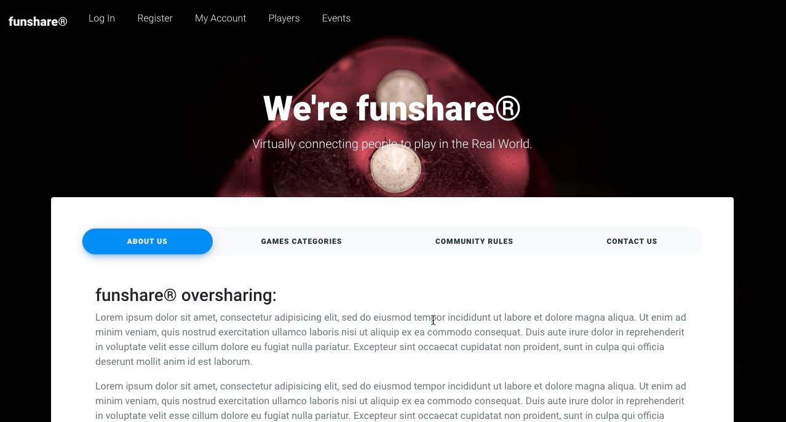

Registration form

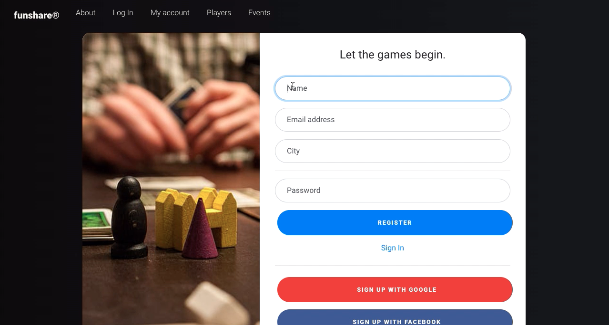

Filter for other players

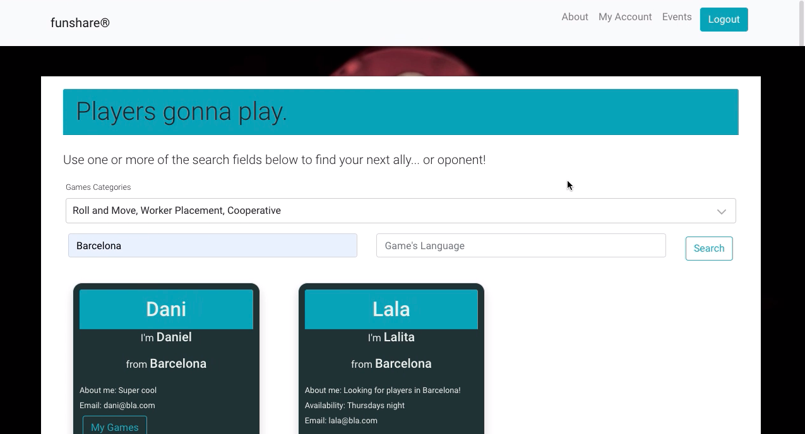

Player's profile

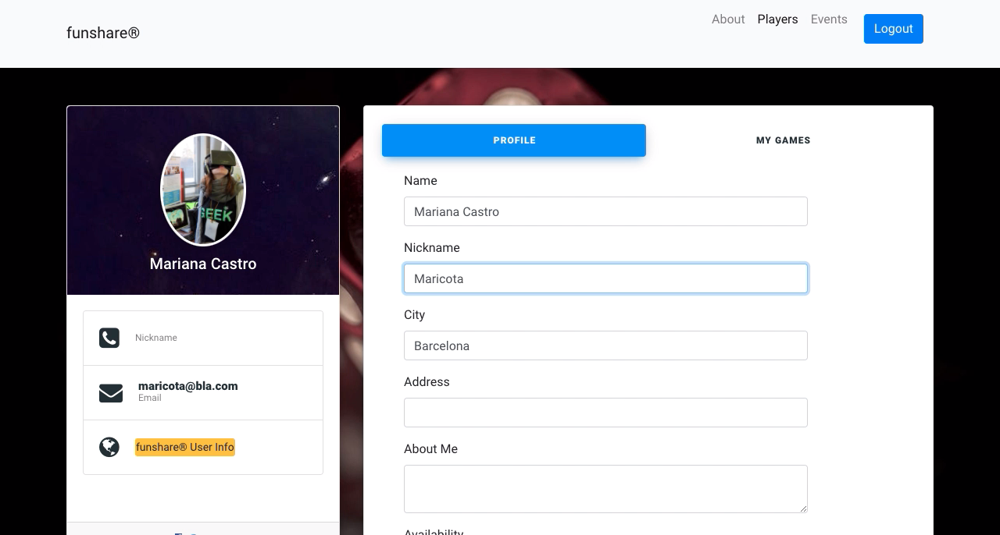

The player can add/delete her/his games

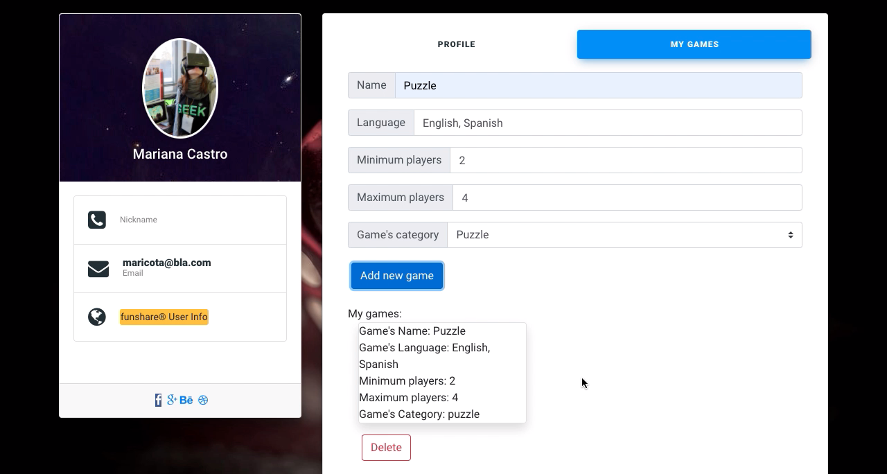

Add fun games events

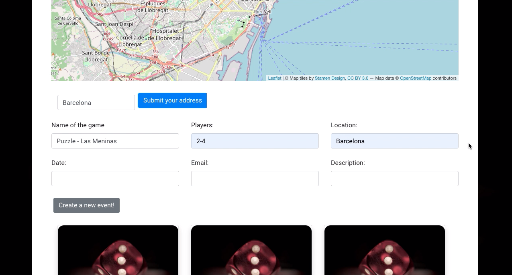

## 🍀 Database schema

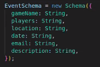

## 🍀 API routes plan

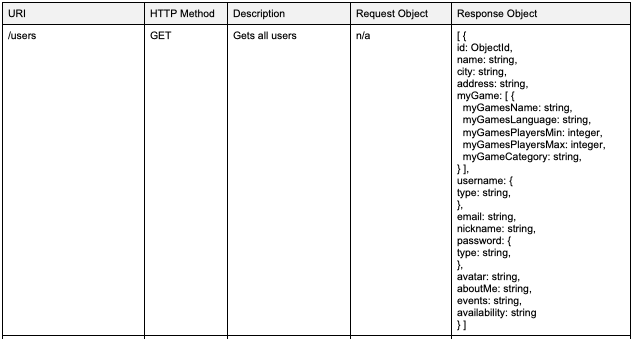
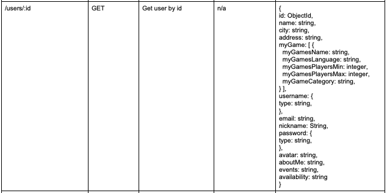

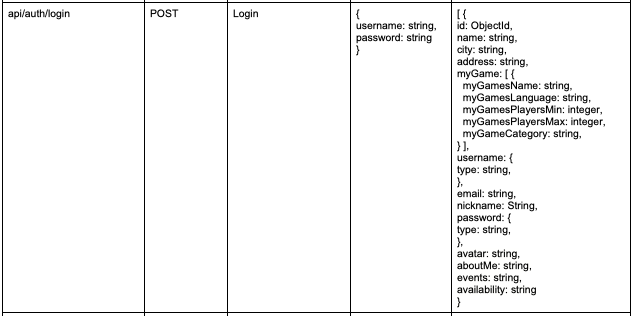

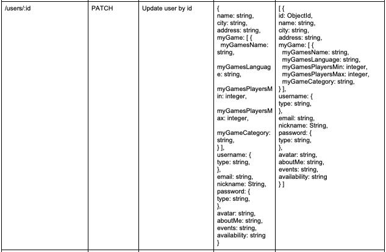

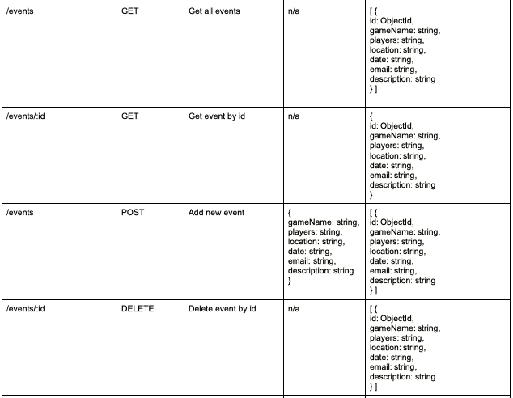

## 🍀 Used technologies

For authentication:

- Passport
- bcrypt
- JWT

### Frontend

- React
- React Router
- Bootstrap - styling
- Axios
- Leaflet - library for interactive map

### Backend

- Express - to create server and API routes
- Node.js - to run the server
- mongoose - communicate with mongoDb

### Database

- mongoDB

## 🍀 Future features

- Deploy on Heroku
- User communication, direct messages or chat
- User can add avatar
- Geospatial data to find users in specific location/radious
- Using API for game recognition
- User can add event and it's saved to their DB Schema
- Map to show events from DB
- Recommended places friendly for playing boardgames
- Forum where people can ask questions
